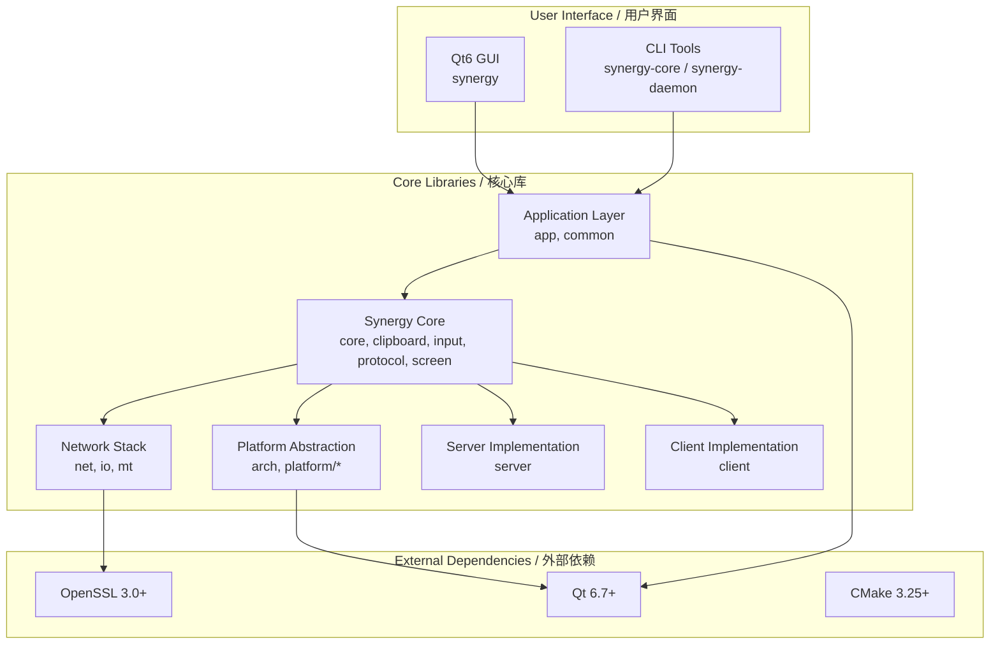

# TuPig Synergy / 跨平台键鼠共享

<div align="center">


**基于 Synergy 的免许可证现代分支 — 一套键鼠，无缝掌控多台电脑。**  
**A modern, license-free fork of Synergy — Share one keyboard and mouse across multiple computers seamlessly.**

</div>

---

## 📊 Project Status / 项目状态

<div align="center">


</div>

**本项目基于 Synergy/Deskflow，移除了序列号验证与许可证激活，开箱即用。**  
**This project is based on Synergy/Deskflow, with serial key verification and license activation removed — ready to use out of the box.**

---

## ✨ Key Features / 核心特性

<div align="center">

| Feature / 特性 | Description / 说明 | Status / 状态 |
|---|---|---|
| 🖱️ **Seamless Sharing / 无缝共享** | One keyboard & mouse across multiple computers / 一套键鼠控制多台电脑 | ✅ Stable / 稳定 |
| 🌐 **Cross-Platform / 跨平台** | Windows, macOS, Linux (X11/Wayland) | ✅ Native / 原生 |
| 🔒 **TLS Encryption / TLS 加密** | Secure communication with OpenSSL 3.0+ / OpenSSL 3.0+ 安全通信 | ✅ Enabled / 已启用 |
| 📋 **Clipboard Sync / 剪贴板同步** | Shared clipboard across all hosts / 所有主机共享剪贴板 | ✅ Full / 完全 |
| 📁 **File Drag-Drop / 文件拖拽** | Windows + macOS implemented; Linux never was — see `docs/HANDOFF.md` §5.6 / Win/mac 已实现，Linux 从未实现（见 `docs/HANDOFF.md` §5.6） | ⚠️ Platform-dependent / 视平台而定 |
| ⌨️ **Hotkey Switching / 热键切屏** | Instant screen switching via custom hotkeys / 自定义热键瞬间切换 | ✅ Configurable / 可配置 |
| 🚫 **No License Required / 无需许可证** | Completely free, no serial keys or activation / 完全免费，无序列号/激活 | ✅ Forever / 永久 |
| 🎨 **Modern Qt6 UI / 现代 Qt6 界面** | Beautiful, responsive graphical interface / 美观、响应式图形界面 | ✅ Polished / 打磨完成 |

</div>

---

## 🏗️ Architecture Overview / 架构概览

<div align="center">



</div>

The diagram names CMake targets. On disk the Windows GUI file is `synergy_<X.Y.Z>.exe`. Linux keeps an unversioned `synergy` binary. macOS ships `TuPig Synergy.app`. `synergy-core` and `synergy-daemon` stay unversioned on every platform.

图中是 CMake 目标名。Windows 上 GUI 文件是 `synergy_<X.Y.Z>.exe`。Linux 的 GUI 仍是不带版本号的 `synergy`。macOS 交付 `TuPig Synergy.app`。`synergy-core` 与 `synergy-daemon` 在各平台都不带版本号。

---

## 🚀 Quick Start / 快速开始

### One-command build / 一条命令构建

Qt 与 OpenSSL 由仓库内 vcpkg 清单安装，不要再装一份系统 Qt，也不要设置 `VCPKG_ROOT`。版本号只来自 `cmake/Version.cmake`（当前 `1.21.2`）。`scripts\build.bat release` 与 `./scripts/build.sh release` 会打开 `SYNERGY_VERSION_RELEASE`，版本字符串是 `X.Y.Z`，不含 `-dev`。

Qt and OpenSSL come from the repository vcpkg manifest. Do not install a second Qt, and do not set `VCPKG_ROOT`. The version comes only from `cmake/Version.cmake` (currently `1.21.2`). `scripts\build.bat release` and `./scripts/build.sh release` set `SYNERGY_VERSION_RELEASE`, so the version string is `X.Y.Z` with no `-dev` suffix.

```bat
git clone https://github.com/Tupig/Tupig_synergy.git
cd Tupig_synergy

REM Windows: once, as Administrator (CMake, MSVC Build Tools, Git)
setup.bat
scripts\build.bat release
```

```bash
# macOS Apple Silicon, or Linux. Host tools only: CMake 3.25+, Ninja, a C++ compiler.
# macOS also needs Xcode Command Line Tools. Linux also needs the X11 / libei / libportal packages in docs/build.md.
./scripts/build.sh release
```

| Platform / 平台 | GUI | Core | Daemon |
|---|---|---|---|
| Windows | `build\bin\Release\synergy_<X.Y.Z>.exe` | `build\bin\Release\synergy-core.exe` | `build\bin\Release\synergy-daemon.exe` |
| Linux | `build/bin/synergy` | `build/bin/synergy-core` | — |
| macOS | `build/bin/TuPig Synergy.app` | `build/bin/synergy-core` | — |

`./scripts/build.sh` on macOS uses the `macos-release` preset (`arm64-osx`). Intel x86_64 is the Actions job `macos-x64`, not that preset. Details, packaging, and tests: [docs/build.md](docs/build.md).

macOS 上 `./scripts/build.sh` 使用预设 `macos-release`（`arm64-osx`）。Intel x86_64 由 Actions 作业 `macos-x64` 构建，不是这个预设。打包与测试见 [docs/build.md](docs/build.md)。

> **MSVC**：`setup.bat` 弹出 Visual Studio 安装器时，安装前必须勾选 **“使用 C++ 的桌面开发”**。换机器时重新运行 `setup.bat` 即可，它只补缺。
>
> When `setup.bat` opens the Visual Studio installer, select **Desktop development with C++** before installing. On another machine, run `setup.bat` again; it only installs what is missing.

### Prebuilt packages / 预编译包

Actions 工作流 **TuPig Synergy**（`.github/workflows/ci.yml`）在 `package-type=release` 时用同一条 CMake 命令构建三端 Release：Windows MSVC、macOS AppleClang（arm64 与 x86_64）、Linux gcc。打好的安装包会挂到 GitHub Release 标签 `v<X.Y.Z>`（例如 [v1.21.2](https://github.com/Tupig/Tupig_synergy/releases/tag/v1.21.2)）。仓库还没配置代码签名 secret 时，Windows 包会跳过签名并给出警告。发布作业会对这些安装包做 GitHub 构建来源证明；下载后可用 `gh attestation verify <文件> --repo Tupig/Tupig_synergy` 核对。已发布的 v1.21.2 是在加入该步骤之前构建的，没有这份证明。

The **TuPig Synergy** Actions workflow (`.github/workflows/ci.yml`) with `package-type=release` builds all three platforms from one CMake command: Windows MSVC, macOS AppleClang (arm64 and x86_64), and Linux gcc. The packages are attached to the GitHub Release tag `v<X.Y.Z>` (for example [v1.21.2](https://github.com/Tupig/Tupig_synergy/releases/tag/v1.21.2)). Until the Windows code-signing secrets exist, those Windows packages are unsigned and the job says so. The publish job attaches a GitHub build-provenance attestation to those packages; after downloading one, check it with `gh attestation verify <file> --repo Tupig/Tupig_synergy`. The existing v1.21.2 assets were built before that step, so they have no attestation.

---

## 📁 Project Structure / 项目结构

```
TuPig Synergy (repo root)
├── cmake/                      # CMake modules (incl. version & Synergy helpers)
├── config/                     # Tool configs (SonarQube, test settings sample)
├── deploy/                     # Platform packaging (DEB/RPM, DMG, MSI/7Z, Flatpak)
├── docs/                       # Documentation
├── scripts/                    # Build & CI scripts (build.bat, build.sh, ci/)
├── src/                        # Source code
│   ├── apps/                   # Entry points (core, daemon, gui) + res/ branding
│   ├── lib/                    # 11 core libraries + synergy overlay
│   └── unittests/              # Qt Test unit tests
├── translations/               # Qt .ts translation files
├── triplets/                   # vcpkg overlay triplets (static linking)
├── vcpkg.json                  # vcpkg dependency manifest
├── CMakeLists.txt              # Root build config
├── CMakePresets.json           # Build presets (per-platform)
└── README.md                   # This file
```

---

## 🔧 Configuration / 配置

### Settings (GUI INI / 设置文件)

Real keys live in `src/lib/common/Settings.h`. Example (`~/.config/TuPig Synergy/TuPig Synergy.conf` on Linux; see `Settings.h` for per-OS paths):

```ini
[core]
computerName = my-desktop
port = 24800
interface = 0.0.0.0

[client]
remoteHost = 192.168.1.100
dynamicConnectionInterval = true
```

Server screen layout is a **separate** config file (`screens`, `main.position`, …), not these settings — see [configuration.md](docs/configuration.md).

---

## 📚 Documentation / 文档

| Document | Description |
|---|---|
| [build.md](docs/build.md) | Detailed Build Guide / 编译指南 |
| [protocol.md](docs/protocol.md) | Protocol Reference / 协议参考 (v1.8) |
| [configuration.md](docs/configuration.md) | Configuration Reference / 配置参考 |
| [troubleshooting.md](docs/troubleshooting.md) | Troubleshooting Guide / 故障排查 |
| [security.md](docs/security.md) | Security Policy / 安全策略 |
| [HANDOFF.md](docs/HANDOFF.md) | Session Handoff / 会话交接 (progress, open items, G1 checklist) |
| [Wiki](https://github.com/Tupig/Tupig_synergy/wiki) | Short map of these docs / 上述文档的简短索引 |

---

## 📜 License / 许可证

<div align="center">

本项目遵循 **GPL-2.0-only WITH LicenseRef-OpenSSL-Exception** — 详见 [LICENSE](LICENSE) 与 [LICENSES/LicenseRef-OpenSSL-Exception.txt](LICENSES/LicenseRef-OpenSSL-Exception.txt)  
This project is licensed under **GPL-2.0-only WITH LicenseRef-OpenSSL-Exception** — see [LICENSE](LICENSE) and [LICENSES/LicenseRef-OpenSSL-Exception.txt](LICENSES/LicenseRef-OpenSSL-Exception.txt)

</div>

---

## 🙏 Acknowledgments / 致谢

| Project | Role | License |
|---|---|---|
| [Synergy](https://github.com/symless/synergy) | Original upstream | GPL-2.0 |
| [Deskflow](https://deskflow.org) | Community upstream | GPL-2.0 |
| [Qt](https://www.qt.io/) | GUI Framework | LGPL-3.0 / Commercial |
| [OpenSSL](https://www.openssl.org/) | TLS/Crypto | Apache-2.0 |
| [CMake](https://cmake.org/) | Build System | BSD-3-Clause |
| [vcpkg](https://github.com/microsoft/vcpkg) | Dependency Manager | MIT |

---

<div align="center">

### ⭐ If you find this project useful, please consider giving it a star! / 如果这个项目对你有帮助，欢迎点个 Star！

[](https://star-history.com/#Tupig/Tupig_synergy&Date)

</div>
