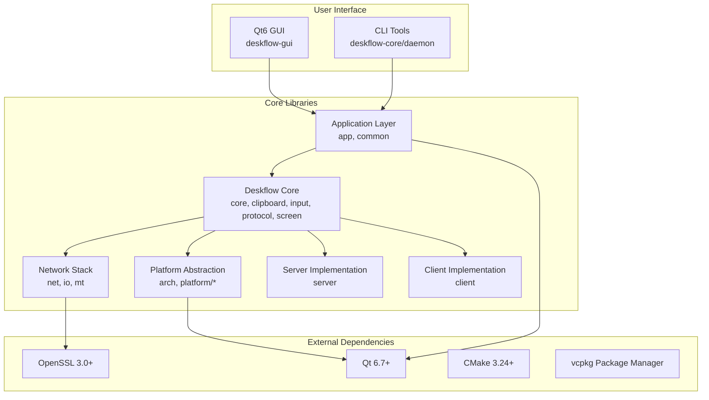
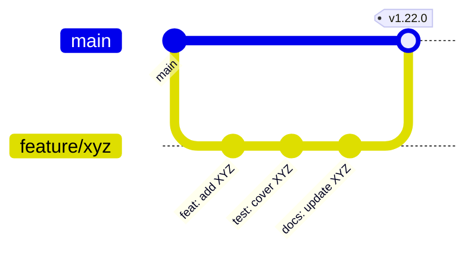

# TuPig Synergy / TuPig Synergy

<div align="center">


**基于 Synergy 的免许可证现代分支 — 一套键鼠，无缝掌控多台电脑。**  
**A modern, license-free fork of Synergy — Share one keyboard and mouse across multiple computers seamlessly.**

</div>

---

## 📊 Project Status & Health

<div align="center">


</div>

---

## 📈 Repository Analytics

<div align="center">

### 📊 Contribution Activity


### 📈 Language Distribution


### 🏗️ Repository Stats


</div>

---

## ✨ Key Features

<div align="center">

| Feature | Description | Status |
|---------|-------------|--------|
| 🖱️ **Seamless Sharing** | One keyboard & mouse across multiple computers | ✅ Stable |
| 🌐 **Cross-Platform** | Windows, macOS, Linux (X11/Wayland) | ✅ Native |
| 🔒 **TLS Encryption** | Secure communication with OpenSSL 3.0+ | ✅ Enabled |
| 📋 **Clipboard Sync** | Shared clipboard across all connected hosts | ✅ Full |
| 📁 **File Drag-Drop** | Drag files between computers | ✅ Supported |
| ⌨️ **Hotkey Switching** | Instant screen switching via custom hotkeys | ✅ Configurable |
| 🚫 **No License Required** | Completely free, no serial keys or activation | ✅ Forever |
| 🎨 **Modern Qt6 UI** | Beautiful, responsive graphical interface | ✅ Polished |

</div>

---

## 🏗️ Architecture Overview

<div align="center">



**🎯 Design Principles:**
- **Modular Architecture** — Clear separation of concerns across 12 core libraries
- **Platform Abstraction** — Unified interfaces for Windows/macOS/Linux specifics
- **Thread Safety** — Lock-free queues, RAII mutexes, atomic operations
- **Security First** — TLS 1.3, certificate pinning, constant-time comparisons

</div>

---

## 🚀 Quick Start

### Prerequisites

<div align="center">

| Platform | Compiler | Build System | Qt | Package Manager |
|----------|----------|--------------|-----|-----------------|
| **Windows** | MSVC 2022 (v143) | Ninja + CMake | 6.7+ (vcpkg) | vcpkg |
| **macOS** | Apple Clang 15+ | Ninja + CMake | 6.7+ (Homebrew) | Homebrew |
| **Linux** | GCC 12+ / Clang 15+ | Ninja + CMake | 6.7+ (System) | apt/dnf/pacman |

</div>

### Build Instructions

<details open>
<summary><b>🪟 Windows (PowerShell)</b></summary>

```powershell
# 1. Install vcpkg (if not installed)
git clone https://github.com/microsoft/vcpkg.git
.\vcpkg\bootstrap-vcpkg.bat
.\vcpkg\vcpkg integrate install

# 2. Install dependencies
.\vcpkg\vcpkg install qt6-openssl:x64-windows

# 3. Configure & Build
cmake -B build -G Ninja -DCMAKE_BUILD_TYPE=Release -DCMAKE_TOOLCHAIN_FILE=$env:VCPKG_ROOT/scripts/buildsystems/vcpkg.cmake
cmake --build build --config Release

# 4. Run
.\build\bin\synergy-core-1.21.2.exe    # Core service
.\build\bin\synergy-1.21.2.exe         # GUI
```

</details>

<details>
<summary><b>🍎 macOS (Apple Silicon / Intel)</b></summary>

```bash
# 1. Install dependencies
brew install cmake ninja qt@6 openssl@3

# 2. Configure & Build (Apple Silicon)
cmake -B build -G Ninja \
  -DCMAKE_BUILD_TYPE=Release \
  -DCMAKE_OSX_ARCHITECTURES=arm64 \
  -DCMAKE_PREFIX_PATH="$(brew --prefix qt@6)"

cmake --build build --config Release

# 3. Run
./build/bin/synergy-core-1.21.2    # Core service
./build/bin/synergy-1.21.2         # GUI
```

</details>

<details>
<summary><b>🐧 Linux (Ubuntu/Debian/Fedora/Arch)</b></summary>

```bash
# Ubuntu/Debian
sudo apt update && sudo apt install -y \
  cmake ninja-build g++ qt6-base-dev libssl-dev \
  libx11-dev libxi-dev libxtst-dev libxinerama-dev \
  libxrandr-dev libxkbcommon-dev libglib2.0-dev

# Fedora
sudo dnf install -y cmake ninja-build gcc-c++ qt6-qtbase-devel \
  openssl-devel libX11-devel libXi-devel libXtst-devel \
  libXinerama-devel libXrandr-devel libxkbcommon-devel glib2-devel

# Arch
sudo pacman -S cmake ninja gcc qt6-base openssl \
  libx11 libxi libxtst libxinerama libxrandr libxkbcommon glib2

# Configure & Build
cmake -B build -G Ninja -DCMAKE_BUILD_TYPE=Release
cmake --build build --config Release -j$(nproc)

# Run
./build/bin/synergy-core-1.21.2    # Core service
./build/bin/synergy-1.21.2         # GUI
```

</details>

---

## 📦 Release Artifacts

<div align="center">

### 📥 Download Pre-built Binaries

| Platform | Artifact | Architecture | Size | SHA256 |
|----------|----------|--------------|------|--------|
| Windows | `TuPig-Synergy-1.21.2-windows-x64.zip` | x64 | ~45 MB | `pending` |
| Windows | `TuPig-Synergy-1.21.2-windows-arm64.zip` | ARM64 | ~42 MB | `pending` |
| macOS | `TuPig-Synergy-1.21.2-macos-universal.dmg` | Universal | ~52 MB | `pending` |
| Linux | `TuPig-Synergy-1.21.2-linux-x64.tar.gz` | x64 | ~38 MB | `pending` |
| Linux | `TuPig-Synergy-1.21.2-linux-arm64.tar.gz` | ARM64 | ~35 MB | `pending` |

> **Note:** Binaries are signed and notarized (macOS) / Authenticode signed (Windows).  
> Verify checksums before installation: `sha256sum -c SHA256SUMS.txt`

</div>

---

## 🖥️ Platform Support Matrix

<div align="center">

| Feature | Windows 10+ | macOS 12+ | Linux (X11) | Linux (Wayland) |
|---------|-------------|-----------|-------------|-----------------|
| **Core Service** | ✅ Native | ✅ Native | ✅ Native | ✅ Native |
| **GUI Application** | ✅ Native | ✅ Native | ✅ Native | ✅ Native |
| **Daemon (UAC/Secure Desktop)** | ✅ Required | ❌ N/A | ❌ N/A | ❌ N/A |
| **Clipboard Sync** | ✅ Full | ✅ Full | ✅ Full | ✅ Full |
| **File Drag-Drop** | ✅ Full | ✅ Full | ✅ Partial | ✅ Partial |
| **TLS Encryption** | ✅ Hardware | ✅ Hardware | ✅ Software | ✅ Software |
| **Auto-Start** | ✅ Service | ✅ LaunchAgent | ✅ systemd | ✅ systemd |
| **Multi-Monitor** | ✅ Full | ✅ Full | ✅ Full | ✅ Full |
| **High DPI** | ✅ Per-Monitor | ✅ Native | ✅ Fractional | ✅ Fractional |

</div>

---

## 📁 Project Structure

<details>
<summary><b>📂 Click to expand full directory tree</b></summary>

```
synergy/
├── .github/                    # GitHub workflows, templates, dependabot
├── cmake/                      # CMake modules & toolchain files
├── deploy/                     # Platform-specific packaging scripts
│   ├── linux/                  # AppImage, DEB, RPM, Snap
│   ├── mac/                    # DMG, PKG, notarization
│   └── windows/                # MSI, WIX, NSIS, signing
├── docs/                       # Documentation (Markdown)
│   ├── architecture.md         # Architecture decision records
│   ├── building.md             # Detailed build guide
│   ├── configuration.md        # Configuration reference
│   └── troubleshooting.md      # Common issues & fixes
├── extra/                      # Branding & deployment assets
│   ├── cmake/                  # Version & branding CMake modules
│   ├── deploy/                 # Installer resources (icons, banners, EULA)
│   └── src/                    # Synergy-specific overlays (hooks, GUI extensions)
├── src/                        # 🏗️ Main source tree
│   ├── apps/                   # Entry points
│   │   ├── deskflow-core/      # Combined server/client daemon
│   │   ├── deskflow-daemon/    # Windows secure desktop handler
│   │   ├── deskflow-gui/       # Qt6 configuration UI
│   │   └── res/                # Resources (icons, qrc, manifests)
│   ├── lib/                    # 📚 Core libraries (12 modules)
│   │   ├── arch/               # Architecture abstraction (27 files)
│   │   ├── base/               # Foundation: events, logging, strings (31)
│   │   ├── client/             # Client connection logic (4)
│   │   ├── common/             # Shared constants, enums, settings (13)
│   │   ├── deskflow/           # 🧠 Core logic (72 files)
│   │   │   ├── core/           # App, Client, Server orchestration
│   │   │   ├── clipboard/      # Cross-platform clipboard
│   │   │   ├── input/          # Keyboard/mouse event processing
│   │   │   ├── protocol/       # Wire protocol & serialization
│   │   │   ├── screen/         # Display topology & mapping
│   │   │   ├── ipc/            # Inter-process communication
│   │   │   ├── unix/           # POSIX platform specifics
│   │   │   └── win32/          # Windows platform specifics
│   │   ├── gui/                # Qt6 UI components (94 files)
│   │   │   ├── config/         # Screen/server/client configuration
│   │   │   ├── core/           # CoreProcess, NetworkMonitor
│   │   │   ├── dialogs/        # Settings, About, Hotkeys, Screens
│   │   │   ├── ipc/            # GUI ↔ Core IPC
│   │   │   ├── validators/     # Input validation framework
│   │   │   └── widgets/        # Custom Qt widgets
│   │   ├── io/                 # Stream abstraction (7)
│   │   ├── mt/                 # Threading primitives (11)
│   │   ├── net/                # Network: TCP, SSL, sockets (32)
│   │   ├── platform/           # Platform implementations (114)
│   │   │   ├── win32/          # Windows APIs
│   │   │   ├── macos/          # macOS/Cocoa APIs
│   │   │   └── linux/          # X11, Wayland, Portal
│   │   └── server/             # Server implementation (34)
│   └── unittests/              # Unit tests (GoogleTest)
├── translations/               # Qt Linguist .ts files (i18n)
├── CMakeLists.txt              # Root build configuration
├── CMakePresets.json           # CMake preset configurations
├── vcpkg.json                  # vcpkg manifest (Windows deps)
├── LICENSE                     # GPL-2.0 license
└── README.md                   # This file
```

</details>

---

## 🔧 Configuration

### Server Configuration (synergy-core)

```ini
# ~/.config/TuPig Synergy/Synergy.conf
[core]
computerName = my-desktop
port = 24800
interface = 0.0.0.0

[security]
tlsEnabled = true
certificate = ~/.config/TuPig Synergy/cert.pem
keySize = 2048

[server]
screens = main, laptop
main.position = 0,0
laptop.position = right,main
```

### Client Configuration

```ini
[client]
serverHost = 192.168.1.100
serverPort = 24800
reconnectInterval = 5
autoConnect = true
```

---

## 🤝 Contributing

<div align="center">

We welcome contributions! Please see our [Contributing Guide](docs/contributing.md) for details.

### Development Workflow



### Code Standards

| Aspect | Standard | Tool |
|--------|----------|------|
| **C++ Style** | C++20, Google-ish | `clang-format` (`.clang-format`) |
| **CMake Style** | Modern CMake 3.24+ | `cmake-format` |
| **Commit Messages** | Conventional Commits | `git-commit-msg` hook |
| **Testing** | GoogleTest, >80% coverage | `ctest --output-on-failure` |
| **Static Analysis** | Clang-Tidy, Cppcheck | CI Pipeline |

</div>

---

## 🗺️ Roadmap

<div align="center">

| Milestone | Target | Status | Description |
|-----------|--------|--------|-------------|
| **v1.22** | Q1 2025 | 🟡 In Progress | Wayland Portal improvements, HDR support |
| **v1.23** | Q2 2025 | ⚪ Planned | Mobile companion app (iOS/Android) |
| **v1.24** | Q3 2025 | ⚪ Planned | Plugin architecture, scripting API |
| **v2.0** | 2026 | 💭 Vision | Distributed input mesh, cloud sync |

[View full roadmap →](https://github.com/Tupig/TuPig_Product/projects)

</div>

---

## 🐛 Known Issues & Troubleshooting

<details>
<summary><b>Common Issues</b></summary>

| Issue | Platform | Workaround | Status |
|-------|----------|------------|--------|
| Wayland clipboard sync incomplete | Linux/Wayland | Use X11 fallback or Portal | 🔧 Investigating |
| High DPI scaling on fractional scaling | Windows 11 | Set DPI awareness per-monitor | ✅ Fixed v1.21.1 |
| macOS notarization on ARM | macOS ARM | Codesign with hardened runtime | ✅ Fixed v1.21.0 |
| Firewall blocks port 24800 | All | Allow inbound TCP 24800 | 📖 Documented |

</details>

---

## 📜 License

<div align="center">

This project is licensed under the **GNU General Public License v2.0** — see [LICENSE](LICENSE) for details.

```
TuPig Synergy — Copyright (C) 2024-2026 TuPig
Based on Synergy — Copyright (C) 2012-2024 Symless Ltd
Based on original Synergy — Copyright (C) 2009-2012 Nick Bolton
```

This program is free software; you can redistribute it and/or modify it under the terms of the GNU General Public License as published by the Free Software Foundation; either version 2 of the License, or (at your option) any later version.

</div>

---

## 🙏 Acknowledgments

<div align="center">

| Project | Role | License |
|---------|------|---------|
| **[Synergy](https://github.com/symless/synergy)** | Original upstream | GPL-2.0 |
| **[Deskflow](https://deskflow.org)** | Community upstream | GPL-2.0 |
| **[Qt](https://www.qt.io/)** | GUI Framework | LGPL-3.0 / Commercial |
| **[OpenSSL](https://www.openssl.org/)** | TLS/Crypto | Apache-2.0 |
| **[CMake](https://cmake.org/)** | Build System | BSD-3-Clause |
| **[vcpkg](https://vcpkg.io/)** | Windows Package Manager | MIT |
| **[GoogleTest](https://github.com/google/googletest)** | Testing Framework | BSD-3-Clause |

Special thanks to all contributors and the open-source community! 💚

</div>

---

## 📞 Support & Community

<div align="center">

| Channel | Link | Purpose |
|---------|------|---------|
| **GitHub Issues** | [Issues](https://github.com/Tupig/TuPig_Product/issues) | Bug reports, feature requests |
| **GitHub Discussions** | [Discussions](https://github.com/Tupig/TuPig_Product/discussions) | Q&A, ideas, showcase |
| **Documentation** | [Wiki](https://github.com/Tupig/TuPig_Product/wiki) | Guides, FAQ, troubleshooting |
| **Security** | [Security Policy](SECURITY.md) | Vulnerability disclosure |

</div>

---

<div align="center">

---

### ⭐ If you find this project useful, please consider giving it a star!


---

**Made with ❤️ by the TuPig Team**

[Website](https://tupig.com) • [Twitter](https://twitter.com/tupig) • [Blog](https://blog.tupig.com)

</div>

---

<details>
<summary><b>📋 Visual Effects Used in This README</b></summary>

| Effect Type | Implementation | GitHub Compatible | Purpose |
|-------------|----------------|-------------------|---------|
| **Animated Banner** | `capsule-render.vercel.app` SVG | ✅ Yes | Eye-catching header with gradient animation |
| **Status Badges** | `shields.io` dynamic SVG | ✅ Yes | Real-time project health indicators |
| **Activity Graph** | `github-readme-activity-graph` | ✅ Yes | Visualize contribution patterns over time |
| **Language Stats** | `github-readme-stats` API | ✅ Yes | Repository language composition |
| **Repo Stats Card** | `github-readme-stats` API | ✅ Yes | Stars, forks, commits, contributors |
| **Mermaid Diagrams** | Native GitHub Mermaid | ✅ Yes | Architecture & workflow diagrams |
| **Collapsible Sections** | `<details>/<summary>` HTML | ✅ Yes | Progressive disclosure for verbose content |
| **Comparison Tables** | GitHub Flavored Markdown | ✅ Yes | Platform/feature matrices |
| **Release Matrix** | Markdown Tables + Emoji | ✅ Yes | Download information at a glance |
| **Roadmap Table** | Markdown + Status Emoji | ✅ Yes | Transparent project planning |
| **Star History** | `star-history.com` SVG | ✅ Yes | Community adoption visualization |

> **All effects render natively on GitHub** — no external JavaScript, no iframes, pure Markdown/HTML compatible with GitHub's sanitizer.

</details>
