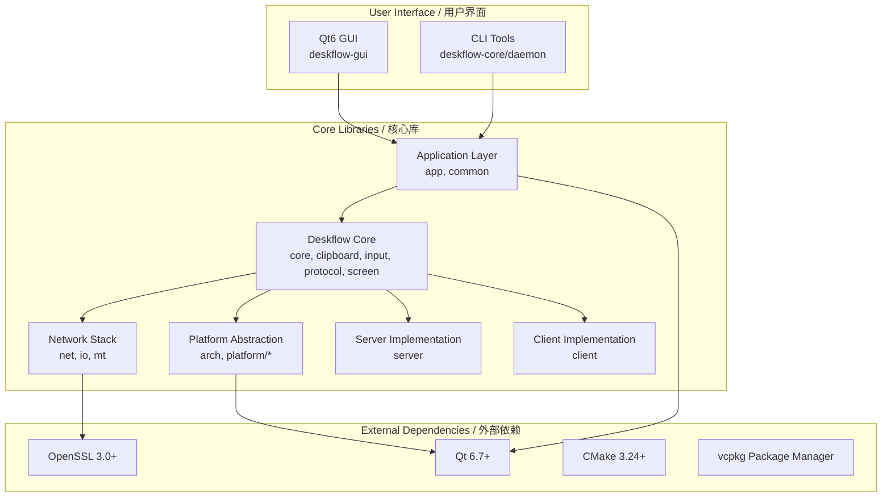
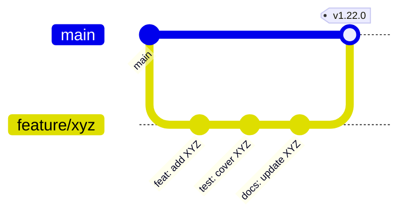

# TuPig Synergy / TuPig Synergy

<div align="center">


**基于 Synergy 的免许可证现代分支 — 一套键鼠，无缝掌控多台电脑。**  
**A modern, license-free fork of Synergy — Share one keyboard and mouse across multiple computers seamlessly.**

</div>

---

## 📊 Project Status / 项目状态

<div align="center">


</div>

**本项目基于 Synergy/Deskflow，移除了序列号验证与许可证激活，开箱即用。**  
**This project is based on Synergy/Deskflow, with serial key verification and license activation removed — ready to use out of the box.**

---

## ✨ Key Features / 核心特性

<div align="center">

| Feature / 特性 | Description / 说明 | Status / 状态 |
|---|---|---|
| 🖱️ **Seamless Sharing / 无缝共享** | One keyboard & mouse across multiple computers / 一套键鼠控制多台电脑 | ✅ Stable / 稳定 |
| 🌐 **Cross-Platform / 跨平台** | Windows, macOS, Linux (X11/Wayland) | ✅ Native / 原生 |
| 🔒 **TLS Encryption / TLS 加密** | Secure communication with OpenSSL 3.0+ / OpenSSL 3.0+ 安全通信 | ✅ Enabled / 已启用 |
| 📋 **Clipboard Sync / 剪贴板同步** | Shared clipboard across all hosts / 所有主机共享剪贴板 | ✅ Full / 完全 |
| 📁 **File Drag-Drop / 文件拖拽** | Drag files between computers / 电脑间拖拽文件 | ✅ Supported / 支持 |
| ⌨️ **Hotkey Switching / 热键切屏** | Instant screen switching via custom hotkeys / 自定义热键瞬间切换 | ✅ Configurable / 可配置 |
| 🚫 **No License Required / 无需许可证** | Completely free, no serial keys or activation / 完全免费，无序列号/激活 | ✅ Forever / 永久 |
| 🎨 **Modern Qt6 UI / 现代 Qt6 界面** | Beautiful, responsive graphical interface / 美观、响应式图形界面 | ✅ Polished / 打磨完成 |

</div>

---

## 🏗️ Architecture Overview / 架构概览

<div align="center">



**Design Principles / 设计原则：**
- **Modular Architecture / 模块化架构** — 12 个核心库，关注点分离
- **Platform Abstraction / 平台抽象** — 统一接口屏蔽 Windows/macOS/Linux 差异
- **Thread Safety / 线程安全** — 无锁队列、RAII 互斥锁、原子操作
- **Security First / 安全优先** — TLS 1.3、证书绑定、常数时间比较

</div>

---

## 🚀 Quick Start / 快速开始

### Prerequisites / 编译依赖

| Platform / 平台 | Compiler / 编译器 | Build System / 构建系统 | Qt | Package Manager / 包管理器 |
|---|---|---|---|---|
| **Windows** | MSVC 2022 (v143) | Ninja + CMake | 6.7+ (vcpkg) | vcpkg |
| **macOS** | Apple Clang 15+ | Ninja + CMake | 6.7+ (Homebrew) | Homebrew |
| **Linux** | GCC 12+ / Clang 15+ | Ninja + CMake | 6.7+ (System) | apt/dnf/pacman |

### Build Instructions / 编译步骤

<details>
<summary><b>🪟 Windows (PowerShell)</b></summary>

```powershell
# 1. 安装 vcpkg (如未安装)
git clone https://github.com/microsoft/vcpkg.git
.\vcpkg\bootstrap-vcpkg.bat
.\vcpkg\vcpkg integrate install

# 2. 安装依赖
.\vcpkg\vcpkg install qt6-openssl:x64-windows

# 3. 配置与编译
cmake -B build -G Ninja -DCMAKE_BUILD_TYPE=Release -DCMAKE_TOOLCHAIN_FILE=$env:VCPKG_ROOT/scripts/buildsystems/vcpkg.cmake
cmake --build build --config Release

# 4. 运行
.\build\bin\synergy-core-1.21.2.exe    # 核心服务
.\build\bin\synergy-1.21.2.exe         # GUI
```

</details>

<details>
<summary><b>🍎 macOS (Apple Silicon / Intel)</b></summary>

```bash
# 1. 安装依赖
brew install cmake ninja qt@6 openssl@3

# 2. 配置与编译 (Apple Silicon 原生)
cmake -B build -G Ninja \
  -DCMAKE_BUILD_TYPE=Release \
  -DCMAKE_OSX_ARCHITECTURES=arm64 \
  -DCMAKE_PREFIX_PATH="$(brew --prefix qt@6)"

cmake --build build --config Release

# 3. 运行
./build/bin/synergy-core-1.21.2    # 核心服务
./build/bin/synergy-1.21.2         # GUI
```

</details>

<details>
<summary><b>🐧 Linux (Ubuntu/Debian/Fedora/Arch)</b></summary>

```bash
# Ubuntu/Debian
sudo apt update && sudo apt install -y \
  cmake ninja-build g++ qt6-base-dev libssl-dev \
  libx11-dev libxi-dev libxtst-dev libxinerama-dev \
  libxrandr-dev libxkbcommon-dev libglib2.0-dev

# Fedora
sudo dnf install -y cmake ninja-build gcc-c++ qt6-qtbase-devel \
  openssl-devel libX11-devel libXi-devel libXtst-devel \
  libXinerama-devel libXrandr-devel libxkbcommon-devel glib2-devel

# Arch
sudo pacman -S cmake ninja gcc qt6-base openssl \
  libx11 libxi libxtst libxinerama libxrandr libxkbcommon glib2

# 配置与编译
cmake -B build -G Ninja -DCMAKE_BUILD_TYPE=Release
cmake --build build --config Release -j$(nproc)

# 运行
./build/bin/synergy-core-1.21.2    # 核心服务
./build/bin/synergy-1.21.2         # GUI
```

</details>

---

## 📁 Project Structure / 项目结构

<details>
<summary><b>📂 点击展开完整目录树</b></summary>

```
synergy/
├── .github/                    # GitHub 工作流、模板、Dependabot
├── cmake/                      # CMake 模块与工具链文件
├── deploy/                     # 平台打包脚本
│   ├── linux/                  # AppImage, DEB, RPM, Snap
│   ├── mac/                    # DMG, PKG, 公证
│   └── windows/                # MSI, WIX, NSIS, 签名
├── docs/                       # 文档
│   ├── architecture.md         # 架构决策记录 (ADR)
│   ├── build.md                # 详细编译指南
│   ├── configuration.md        # 配置参考
│   ├── contributing.md         # 贡献指南
│   ├── protocol.md             # 协议参考
│   ├── security.md             # 安全策略
│   └── troubleshooting.md      # 故障排查
├── extra/                      # 品牌与部署资源
│   ├── cmake/                  # 版本与品牌 CMake 模块
│   ├── deploy/                 # 安装程序资源
│   └── src/                    # Synergy 专用覆盖层
├── src/                        # 🏗️ 主源码树
│   ├── apps/                   # 入口程序
│   │   ├── deskflow-core/      # 核心服务进程
│   │   ├── deskflow-daemon/    # Windows 安全桌面处理
│   │   ├── deskflow-gui/       # Qt6 配置界面
│   │   └── res/                # 资源文件
│   ├── lib/                    # 📚 核心库 (12 模块)
│   │   ├── arch/               # 架构抽象层
│   │   ├── base/               # 基础设施: 事件、日志、字符串
│   │   ├── client/             # 客户端连接逻辑
│   │   ├── common/             # 共享常量、枚举、设置
│   │   ├── deskflow/           # 🧠 核心逻辑
│   │   │   ├── core/           # App/Client/Server 编排
│   │   │   ├── clipboard/      # 跨平台剪贴板
│   │   │   ├── input/          # 键鼠事件处理
│   │   │   ├── protocol/       # 线路协议与序列化
│   │   │   ├── screen/         # 显示拓扑与映射
│   │   │   ├── ipc/            # 进程间通信
│   │   │   ├── unix/           # POSIX 平台细节
│   │   │   └── win32/          # Windows 平台细节
│   │   ├── gui/                # Qt6 UI 组件
│   │   │   ├── config/         # 屏幕/服务端/客户端配置
│   │   │   ├── core/           # CoreProcess, NetworkMonitor
│   │   │   ├── dialogs/        # 设置、关于、热键、屏幕对话框
│   │   │   ├── ipc/            # GUI ↔ Core IPC
│   │   │   ├── validators/     # 输入验证框架
│   │   │   └── widgets/        # 自定义 Qt 控件
│   │   ├── io/                 # 流抽象
│   │   ├── mt/                 # 线程原语
│   │   ├── net/                # 网络: TCP, SSL, Socket
│   │   ├── platform/           # 平台实现
│   │   │   ├── win32/          # Windows API
│   │   │   ├── macos/          # macOS/Cocoa API
│   │   │   └── linux/          # X11, Wayland, Portal
│   │   └── server/             # 服务端实现
│   └── unittests/              # 单元测试 (GoogleTest)
├── translations/               # Qt Linguist .ts 翻译文件
├── CMakeLists.txt              # 根构建配置
├── CMakePresets.json           # CMake 预设配置
├── vcpkg.json                  # vcpkg 清单 (Windows 依赖)
├── LICENSE                     # GPL-2.0 许可证
└── README.md                   # 本文件
```

</details>

---

## 🔧 Configuration / 配置示例

### Server (Primary / 主控端)

```ini
# ~/.config/TuPig Synergy/Synergy.conf
[core]
computerName = my-desktop
port = 24800
interface = 0.0.0.0

[security]
tlsEnabled = true
certificate = ~/.config/TuPig Synergy/cert.pem
keySize = 2048

[server]
screens = main, laptop
main.position = 0,0
laptop.position = right,main
```

### Client (Secondary / 被控端)

```ini
[client]
serverHost = 192.168.1.100
serverPort = 24800
reconnectInterval = 5
autoConnect = true
```

> 完整配置参考：[docs/configuration.md](docs/configuration.md)  
> Full configuration reference: [docs/configuration.md](docs/configuration.md)

---

## 🤝 Contributing / 贡献指南

欢迎各类贡献！请阅读完整指南：

> **Contributing Guide**: [docs/contributing.md](docs/contributing.md)  
> **贡献指南**: [docs/contributing.md](docs/contributing.md)

### Development Workflow / 开发工作流



### Code Standards / 代码规范

| Aspect / 方面 | Standard / 标准 | Tool / 工具 |
|---|---|---|
| **C++ Style / C++ 风格** | C++20, Google-ish | `clang-format` (`.clang-format`) |
| **CMake Style / CMake 风格** | Modern CMake 3.24+ | `cmake-format` |
| **Commit Messages / 提交信息** | Conventional Commits | `git-commit-msg` hook |
| **Testing / 测试** | GoogleTest, >80% coverage | `ctest --output-on-failure` |
| **Static Analysis / 静态分析** | Clang-Tidy, Cppcheck | CI Pipeline |

---

## 📚 Documentation / 文档导航

| Document / 文档 | Description / 说明 |
|---|---|
| [build.md](docs/build.md) | Build Guide / 编译指南 |
| [contributing.md](docs/contributing.md) | Contributing Guide / 贡献指南 |
| [protocol.md](docs/protocol.md) | Protocol Reference / 协议参考 (v1.8) |
| [configuration.md](docs/configuration.md) | Configuration Reference / 配置参考 |
| [architecture.md](docs/architecture.md) | Architecture Decision Records / 架构决策记录 (ADR) |
| [troubleshooting.md](docs/troubleshooting.md) | Troubleshooting Guide / 故障排查指南 |
| [security.md](docs/security.md) | Security Policy / 安全策略 |

---

## 🐛 Known Issues / 已知问题

| Issue / 问题 | Platform / 平台 | Workaround / 变通方案 | Status / 状态 |
|---|---|---|---|
| Wayland clipboard sync incomplete / Wayland 剪贴板同步不全 | Linux/Wayland | Use X11 fallback or Portal / 用 X11 回退或 Portal | 🔧 Investigating / 调查中 |
| High DPI scaling on fractional scaling / 高 DPI 缩放异常 | Windows 11 | Set DPI awareness per-monitor / 设置逐显示器 DPI 感知 | ✅ Fixed v1.21.1 |
| macOS notarization on ARM / macOS ARM 公证失败 | macOS ARM | Codesign with hardened runtime / 硬化运行时签名 | ✅ Fixed v1.21.0 |
| Firewall blocks port 24800 / 防火墙拦截端口 24800 | All / 所有 | Allow inbound TCP 24800 / 放行入站 TCP 24800 | 📖 Documented / 已记录 |

详细故障排查：[docs/troubleshooting.md](docs/troubleshooting.md)  
Detailed troubleshooting: [docs/troubleshooting.md](docs/troubleshooting.md)

---

## 📜 License / 许可证

<div align="center">

本项目遵循 **GNU General Public License v2.0** — 详见 [LICENSE](LICENSE)  
This project is licensed under the **GNU General Public License v2.0** — see [LICENSE](LICENSE)

```
TuPig Synergy — Copyright (C) 2024-2026 TuPig
Based on Synergy — Copyright (C) 2012-2024 Symless Ltd
Based on original Synergy — Copyright (C) 2009-2012 Nick Bolton
```

This program is free software; you can redistribute it and/or modify it under the terms of the GNU General Public License as published by the Free Software Foundation; either version 2 of the License, or (at your option) any later version.

本程序为自由软件；您可依照自由软件基金会发布的 GNU 通用公共许可证第 2 版或更新版本进行再发布与修改。

</div>

---

## 🙏 Acknowledgments / 致谢

<div align="center">

| Project / 项目 | Role / 角色 | License / 许可证 |
|---|---|---|
| **[Synergy](https://github.com/symless/synergy)** | Original upstream / 原始上游 | GPL-2.0 |
| **[Deskflow](https://deskflow.org)** | Community upstream / 社区上游 | GPL-2.0 |
| **[Qt](https://www.qt.io/)** | GUI Framework / GUI 框架 | LGPL-3.0 / Commercial |
| **[OpenSSL](https://www.openssl.org/)** | TLS/Crypto | Apache-2.0 |
| **[CMake](https://cmake.org/)** | Build System / 构建系统 | BSD-3-Clause |
| **[vcpkg](https://vcpkg.io/)** | Windows Package Manager / Windows 包管理器 | MIT |
| **[GoogleTest](https://github.com/google/googletest)** | Testing Framework / 测试框架 | BSD-3-Clause |

Special thanks to all contributors and the open-source community! 💚  
感谢所有贡献者与开源社区！💚

</div>

---

## 📞 Support & Community / 获取帮助

<div align="center">

| Channel / 渠道 | Link / 链接 | Purpose / 用途 |
|---|---|---|
| **GitHub Issues** | [Issues](https://github.com/Tupig/TuPig_Product/issues) | Bug reports, feature requests / Bug 报告、功能请求 |
| **GitHub Discussions** | [Discussions](https://github.com/Tupig/TuPig_Product/discussions) | Q&A, ideas, showcase / 问答、想法、展示 |
| **Documentation / 文档** | [docs/](docs/) | Guides, FAQ, troubleshooting / 指南、常见问题、故障排查 |
| **Security / 安全** | [docs/security.md](docs/security.md) | Vulnerability disclosure / 漏洞披露 |

</div>

---

<div align="center">

---

### ⭐ If you find this project useful, please consider giving it a star!
### 如果这个项目对你有帮助，请给个 Star 支持一下！

[](https://star-history.com/#Tupig/TuPig_Product&Date)

---

**Made with ❤️ by the TuPig Team**
**TuPig 团队倾力打造 ❤️**

[GitHub](https://github.com/Tupig/TuPig_Product) • [Issues](https://github.com/Tupig/TuPig_Product/issues) • [Discussions](https://github.com/Tupig/TuPig_Product/discussions)

</div>
