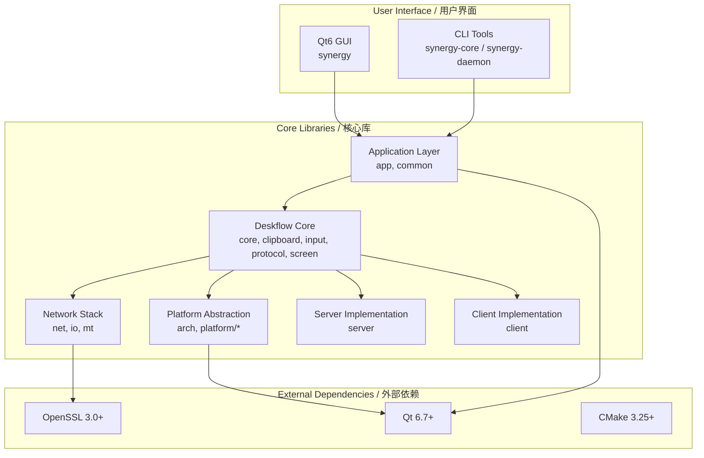

# TuPig Synergy / 跨平台键鼠共享

<div align="center">


**基于 Synergy 的免许可证现代分支 — 一套键鼠，无缝掌控多台电脑。**  
**A modern, license-free fork of Synergy — Share one keyboard and mouse across multiple computers seamlessly.**

</div>

---

## 📊 Project Status / 项目状态

<div align="center">


</div>

**本项目基于 Synergy/Deskflow，移除了序列号验证与许可证激活，开箱即用。**  
**This project is based on Synergy/Deskflow, with serial key verification and license activation removed — ready to use out of the box.**

---

## ✨ Key Features / 核心特性

<div align="center">

| Feature / 特性 | Description / 说明 | Status / 状态 |
|---|---|---|
| 🖱️ **Seamless Sharing / 无缝共享** | One keyboard & mouse across multiple computers / 一套键鼠控制多台电脑 | ✅ Stable / 稳定 |
| 🌐 **Cross-Platform / 跨平台** | Windows, macOS, Linux (X11/Wayland) | ✅ Native / 原生 |
| 🔒 **TLS Encryption / TLS 加密** | Secure communication with OpenSSL 3.0+ / OpenSSL 3.0+ 安全通信 | ✅ Enabled / 已启用 |
| 📋 **Clipboard Sync / 剪贴板同步** | Shared clipboard across all hosts / 所有主机共享剪贴板 | ✅ Full / 完全 |
| 📁 **File Drag-Drop / 文件拖拽** | Not implemented — the v1.5 transfer messages are stubbed out / 未实现 —— v1.5 传输消息为空壳实现 | ❌ Not implemented / 未实现 |
| ⌨️ **Hotkey Switching / 热键切屏** | Instant screen switching via custom hotkeys / 自定义热键瞬间切换 | ✅ Configurable / 可配置 |
| 🚫 **No License Required / 无需许可证** | Completely free, no serial keys or activation / 完全免费，无序列号/激活 | ✅ Forever / 永久 |
| 🎨 **Modern Qt6 UI / 现代 Qt6 界面** | Beautiful, responsive graphical interface / 美观、响应式图形界面 | ✅ Polished / 打磨完成 |

</div>

---

## 🏗️ Architecture Overview / 架构概览

<div align="center">



</div>

---

## 🚀 Quick Start / 快速开始

### One-Click Setup / 一键环境搭建

```bat
REM 1. Clone
git clone https://github.com/Tupig/TuPig_Product.git
cd TuPig_Product

REM 2. Right-click setup.bat → Run as Administrator
REM    (installs CMake, MSVC Build Tools, Git, bootstraps vcpkg)

REM 3. Build (preferred user-facing entry — see AGENTS.md)
cd synergy
scripts\build.bat release

REM Advanced equivalent:
REM   cmake --preset windows-msvc-release
REM   cmake --build build --config Release
```

Output (VS multi-config) / 产物（VS 多配置）: `build\bin\Release\synergy.exe` (GUI / 图形界面),
`build\bin\Release\synergy-core.exe` (core / 核心),
`build\bin\Release\synergy-daemon.exe` (Windows daemon / Windows 守护进程)

### Prerequisites (auto-installed by setup.bat) / 前置依赖（由 setup.bat 自动安装）

| Requirement / 依赖 | Windows | macOS | Linux |
|---|---|---|---|
| **CMake 3.25+** | `setup.bat` installs / 自动安装 | `brew install cmake` | `sudo apt install cmake` |
| **Ninja** | Included with VS Build Tools / 随 VS 构建工具附带 | `brew install ninja` | `sudo apt install ninja-build` |
| **vcpkg** | `setup.bat` bootstraps / 自动引导 | `brew install vcpkg` | manual bootstrap / 手工引导 |
| **MSVC Build Tools** | `setup.bat` installs / 自动安装 | — | — |
| **"Desktop development with C++"** | Select in VS Installer / 在 VS 安装器中勾选 | — | — |

> **Note for MSVC / MSVC 注意**：当 `setup.bat` 安装构建工具时会弹出 Visual Studio 安装器，
> 在点击安装前**必须**勾选 **"使用 C++ 的桌面开发"** 工作负载。

### Switching Machines / 更换机器

Just re-run `setup.bat` — it's idempotent and only installs what's missing.
重新运行 `setup.bat` 即可 —— 它可重复执行，仅安装缺失的部分。

---

## 📁 Project Structure / 项目结构

```
synergy/
├── cmake/                      # CMake modules
├── config/                     # Tool configs (SonarQube)
├── deploy/                     # Platform packaging (DEB/RPM, DMG, MSI/7Z)
├── docs/                       # Documentation
├── extra/                      # Branding, deploy resources
├── scripts/                    # Build scripts (build.bat, build.sh)
├── src/                        # Source code
│   ├── apps/                   # Entry points (core, daemon, gui)
│   ├── lib/                    # 12 core libraries
│   └── unittests/              # GoogleTest unit tests
├── translations/               # Qt .ts translation files
├── triplets/                   # vcpkg overlay triplets (static linking)
├── vcpkg.json                  # vcpkg dependency manifest
├── CMakeLists.txt              # Root build config
├── CMakePresets.json           # Build presets (per-platform)
└── README.md                   # This file
```

---

## 🔧 Configuration / 配置

### Server (Primary / 主控端)

```ini
[core]
computerName = my-desktop
port = 24800
interface = 0.0.0.0

[server]
screens = main, laptop
main.position = 0,0
laptop.position = right,main
```

### Client (Secondary / 被控端)

```ini
[client]
serverHost = 192.168.1.100
serverPort = 24800
reconnectInterval = 5
autoConnect = true
```

---

## 📚 Documentation / 文档

| Document | Description |
|---|---|
| [build.md](docs/build.md) | Detailed Build Guide / 编译指南 |
| [contributing.md](docs/contributing.md) | Contributing Guide / 贡献指南 |
| [protocol.md](docs/protocol.md) | Protocol Reference / 协议参考 (v1.8) |
| [configuration.md](docs/configuration.md) | Configuration Reference / 配置参考 |
| [architecture.md](docs/architecture.md) | Architecture Decision Records / 架构决策记录 |
| [delivery.md](docs/delivery.md) | Delivery Matrix / 交付矩阵 (artifacts, self-containment, constraints) |
| [consistency-audit.md](docs/consistency-audit.md) | Consistency Audit / 一致性审计 (U-01 ~ U-19) |
| [troubleshooting.md](docs/troubleshooting.md) | Troubleshooting Guide / 故障排查 |
| [security.md](docs/security.md) | Security Policy / 安全策略 |

---

## 📜 License / 许可证

<div align="center">

本项目遵循 **GPL-2.0-only WITH LicenseRef-OpenSSL-Exception** — 详见 [LICENSE](LICENSE) 与 [LICENSES/LicenseRef-OpenSSL-Exception.txt](LICENSES/LicenseRef-OpenSSL-Exception.txt)  
This project is licensed under **GPL-2.0-only WITH LicenseRef-OpenSSL-Exception** — see [LICENSE](LICENSE) and [LICENSES/LicenseRef-OpenSSL-Exception.txt](LICENSES/LicenseRef-OpenSSL-Exception.txt)

</div>

---

## 🙏 Acknowledgments / 致谢

| Project | Role | License |
|---|---|---|
| [Synergy](https://github.com/symless/synergy) | Original upstream | GPL-2.0 |
| [Deskflow](https://deskflow.org) | Community upstream | GPL-2.0 |
| [Qt](https://www.qt.io/) | GUI Framework | LGPL-3.0 / Commercial |
| [OpenSSL](https://www.openssl.org/) | TLS/Crypto | Apache-2.0 |
| [CMake](https://cmake.org/) | Build System | BSD-3-Clause |
| [vcpkg](https://github.com/microsoft/vcpkg) | Dependency Manager | MIT |

</div>

---

<div align="center">

### ⭐ If you find this project useful, please consider giving it a star! / 如果这个项目对你有帮助，欢迎点个 Star！

[](https://star-history.com/#Tupig/TuPig_Product&Date)

</div>
