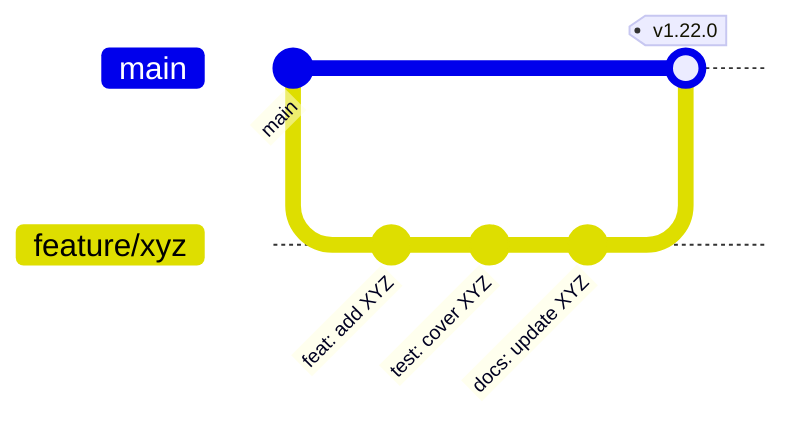

# Contributing Guide / 贡献指南

> **Language / 语言**: [English](#english) | [中文](#中文)

---

## English

Thank you for your interest in contributing to TuPig Synergy! We welcome all forms of contributions — bug reports, feature requests, documentation improvements, code contributions, translations, and testing.

### Quick Start

1. **Fork** the repository
2. **Clone** your fork: `git clone https://github.com/your-username/TuPig_Product.git`
3. **Create a branch**: `git checkout -b feature/your-feature-name`
4. **Make changes** following our coding standards
5. **Test** your changes thoroughly
6. **Submit a Pull Request** with a clear description

---

### Ways to Contribute

| Type | Description | Where to Start |
|------|-------------|----------------|
| 🐛 **Bug Reports** | Found a bug? Report it with details | [GitHub Issues](https://github.com/Tupig/TuPig_Product/issues/new?template=bug_report.md) |
| 💡 **Feature Requests** | Have an idea? Share it | [GitHub Discussions](https://github.com/Tupig/TuPig_Product/discussions) |
| 📝 **Documentation** | Fix typos, add examples, translate | Edit `.md` files in `docs/` |
| 🌐 **Translations** | Add/update Qt `.ts` files | `translations/` directory |
| 💻 **Code** | Fix bugs, add features, refactor | Follow workflow below |
| 🧪 **Testing** | Test on your platform, report issues | Build from source, test |

---

### Development Workflow



#### Branch Naming Convention

| Type | Prefix | Example |
|------|--------|---------|
| **Feature** | `feature/` | `feature/wayland-support` |
| **Bug Fix** | `fix/` | `fix/clipboard-crash` |
| **Documentation** | `docs/` | `docs/update-build-guide` |
| **Refactor** | `refactor/` | `refactor/net-layer` |
| **Test** | `test/` | `test/add-integration-tests` |
| **Chore** | `chore/` | `chore/update-deps` |

#### Commit Message Format (Conventional Commits)

```
<type>(<scope>): <short summary>

<body>

<footer>
```

| Type | Purpose |
|------|---------|
| `feat` | New feature |
| `fix` | Bug fix |
| `docs` | Documentation only |
| `style` | Formatting, no code change |
| `refactor` | Code restructure |
| `test` | Adding tests |
| `chore` | Build/tooling changes |

**Example:**
```
fix(core): resolve clipboard sync race condition

Fixed a race condition in ClipboardManager where concurrent
read/write could corrupt the shared buffer. Added mutex guard
around clipboard data access.

Closes #42
```

---

### Code Standards

| Aspect | Standard | Tool / Config |
|--------|----------|---------------|
| **C++ Version** | C++20 | Enforced by CMake |
| **Formatting** | ClangFormat (Google-based) | `.clang-format` |
| **CMake Style** | Modern CMake 3.25+ | `cmake-format` |
| **Static Analysis** | Clang-Tidy, Cppcheck | CI Pipeline |
| **Testing** | GoogleTest, >80% coverage | `ctest` |
| **Commit Hooks** | Pre-commit (format, lint) | `.pre-commit-config.yaml` |

#### Pre-commit Setup

```bash
# Install pre-commit
pip install pre-commit

# Install hooks
pre-commit install

# Run manually
pre-commit run --all-files
```

---

### Pull Request Checklist

Before submitting, ensure your PR meets these criteria:

- [ ] **Branch** targets `main` (not `develop` or release branches)
- [ ] **Commits** follow Conventional Commits format
- [ ] **Code** passes `clang-format` (run `pre-commit run clang-format`)
- [ ] **Static analysis** passes (`clang-tidy`, `cppcheck`)
- [ ] **Tests** pass (`ctest --output-on-failure`)
- [ ] **Coverage** doesn't decrease significantly
- [ ] **Documentation** updated for user-facing changes
- [ ] **Changelog** entry added (if applicable)
- [ ] **Translations** updated for new strings (run `cmake --build build --target update_translations`)

---

### Code Review Process

1. **Automated Checks** — CI runs format, lint, build, tests
2. **Maintainer Review** — At least one core maintainer approval required
3. **Address Feedback** — Push follow-up commits to same branch
3. **Merge** — Squash and merge after approval (maintains clean history)

---

### Coding Guidelines

#### C++ Best Practices

```cpp
// ✅ DO: Use RAII, smart pointers
auto socket = std::make_unique<TCPSocket>();
socket->connect(host, port);

// ❌ DON'T: Raw owning pointers
TCPSocket* socket = new TCPSocket();

// ✅ DO: Use structured bindings (C++17)
auto [success, data] = parseMessage(buffer);

// ✅ DO: Prefer std::optional over nullptr for optional values
std::optional<ScreenInfo> findScreen(const std::string& name);

// ✅ DO: Use enum class for type safety
enum class ConnectionState { Disconnected, Connecting, Connected };

// ✅ DO: Mark noexcept when possible
void sendKeepAlive() noexcept;

// ✅ DO: Use span for non-owning array views (C++20)
void processData(std::span<const uint8_t> data);
```

#### Header Includes Order

```cpp
// 1. Own header first
#include "MyClass.h"

// 2. Standard library
#include <memory>
#include <vector>

// 3. Third-party (Qt, OpenSSL, etc.)
#include <QObject>
#include <openssl/ssl.h>

// 4. Project headers (alphabetical)
#include "common/Settings.h"
#include "net/TCPSocket.h"
```

#### Error Handling

```cpp
// ✅ Use Result/Expected pattern for fallible operations
std::expected<std::string, ErrorCode> readConfig(const std::string& path);

// ✅ Exceptions only for truly exceptional/unrecoverable cases
void initializeCriticalSubsystem() {
    if (!subsystem.init()) {
        throw InitializationError("Failed to init subsystem");
    }
}
```

---

### Testing Guidelines

| Test Type | Location | Command |
|-----------|----------|---------|
| **Unit Tests** | `src/unittests/` (`base`, `common`, `deskflow`, `gui`, `net`, `platform`, `server`) | `ctest --test-dir build/src/unittests -C Release` |
| **Single suite** | one of the directories above | `ctest --test-dir build/src/unittests -C Release -R <SuiteName>` |

```cpp
// Example test structure
TEST(ClipboardManager, SyncsTextAcrossClients) {
    // Arrange
    auto server = createTestServer();
    auto client = createTestClient();
    
    // Act
    server.setClipboardText("Hello World");
    waitForSync();
    
    // Assert
    EXPECT_EQ(client.getClipboardText(), "Hello World");
}
```

---

### Release Process

| Phase | Responsible | Actions |
|-------|-------------|---------|
| **Pre-release** | Maintainers | Branch `release/vX.Y`, bump version, update changelog |
| **RC Build** | CI | Build all platforms, sign, notarize |
| **Testing** | Community | Test RCs, report regressions |
| **Release** | Maintainers | Tag, publish artifacts, announce |

---

### Upstream Sync

This repository is a fork of [deskflow/deskflow](https://github.com/deskflow/deskflow).
The code lives in the `synergy/` subdirectory, alongside the deactivated Symless
commercial layer (`synergy/extra/`).

#### Fork point

| Item | Value |
|------|-------|
| Upstream | `https://github.com/deskflow/deskflow.git` (remote `upstream`) |
| Fork base | `8ed7a3efe1a453f024b3018882470c5d1df5d003` (2026-06-05, `refactor(FingerprintPreview): Adjust width...`) |
| Basis | A whole-tree `--name-only` comparison against that base gives 261 differing files — the minimum. The next window (`4e121dac`, 2026-06-09, copyright rename, 445 files) jumps to 630. |

Those 261 standing differences are the expected Symless private patches (88 under
`extra/`, plus icon/branding assets, licence stubs and GUI hook wiring) together
with this fork's own changes. They are not a sign of a mis-identified base.

#### History grafting (`git replace --graft`)

The first commit `ad2c280` is a squashed snapshot with no common ancestor with
upstream. It has been grafted onto upstream history so `git merge-base` and
three-way merges work:

```bash
# One-time setup (repeat for each local clone)
git remote add upstream https://github.com/deskflow/deskflow.git
git fetch upstream
git fetch origin 'refs/replace/*:refs/replace/*'   # fetch the graft (preferred)
# or rebuild it by hand:
git replace --graft ad2c280 8ed7a3efe1a453f024b3018882470c5d1df5d003
```

Check: `git log` should show upstream history continuing below `ad2c280`, and
`git merge-base HEAD upstream/master` should print the base commit.

#### Syncing upstream (subtree merge)

Upstream files sit at the repository root while this project lives in `synergy/`,
so the merge needs the subtree strategy:

```bash
git fetch upstream
git merge -Xsubtree=synergy upstream/master
# expected conflicts = the 261 fork-changed files above, plus hot files both sides touched
```

Notes:

- The smaller the changes to upstream files, the fewer future conflicts; prefer
  adding new features in new files or directories.
- `git replace` does not change commit hashes and can be undone with
  `git replace -d ad2c280`.
- Before large-scale cleanups (for example migrating `mt/` to `std`), assess the
  effect on the merge surface.

---

### Community & Support

| Channel | Purpose |
|---------|---------|
| **GitHub Issues** | Bug reports, feature requests |
| **GitHub Discussions** | Questions, ideas, showcase |
| **Wiki** | Extended documentation |
| **Security** | [security.md](security.md) for vulnerabilities |

---

### Recognition

Contributors are credited in the release notes. Thank you! 🙏

---

## 中文

感谢您对 TuPig Synergy 的关注与贡献！我们欢迎各种形式的贡献——Bug 报告、功能建议、文档改进、代码贡献、翻译、测试等。

### 快速开始

1. **Fork** 仓库
2. **Clone** 您的 Fork：`git clone https://github.com/your-username/TuPig_Product.git`
3. **创建分支**：`git checkout -b feature/your-feature-name`
4. **按规范修改代码**
5. **充分测试** 您的更改
6. **提交 Pull Request** 并清晰描述变更

---

### 贡献方式

| 类型 | 说明 | 起始位置 |
|------|------|----------|
| 🐛 **Bug 报告** | 发现 Bug？详细报告 | [GitHub Issues](https://github.com/Tupig/TuPig_Product/issues/new?template=bug_report.md) |
| 💡 **功能建议** | 有想法？分享讨论 | [GitHub Discussions](https://github.com/Tupig/TuPig_Product/discussions) |
| 📝 **文档改进** | 修正错别字、补充示例、翻译 | 编辑 `docs/` 下的 `.md` 文件 |
| 🌐 **翻译** | 新增/更新 Qt `.ts` 翻译文件 | `translations/` 目录 |
| 💻 **代码贡献** | 修复 Bug、新增功能、重构 | 按下述工作流 |
| 🧪 **测试验证** | 在您的平台测试、报告问题 | 源码编译并测试 |

---

### 开发工作流


#### 分支命名规范

| 类型 | 前缀 | 示例 |
|------|------|------|
| **新功能** | `feature/` | `feature/wayland-support` |
| **Bug 修复** | `fix/` | `fix/clipboard-crash` |
| **文档** | `docs/` | `docs/update-build-guide` |
| **重构** | `refactor/` | `refactor/net-layer` |
| **测试** | `test/` | `test/add-integration-tests` |
| **维护** | `chore/` | `chore/update-deps` |

#### 提交信息规范 (Conventional Commits)

```
<type>(<scope>): <简短描述>

<正文>

<页脚>
```

| 类型 | 用途 |
|------|------|
| `feat` | 新功能 |
| `fix` | Bug 修复 |
| `docs` | 仅文档变更 |
| `style` | 格式调整，无代码变更 |
| `refactor` | 代码重构 |
| `test` | 增加测试 |
| `chore` | 构建/工具链变更 |

**示例：**
```
fix(core): resolve clipboard sync race condition

修复 ClipboardManager 中并发读写导致的共享缓冲区损坏竞态条件。
在剪贴板数据访问处增加互斥锁保护。

Closes #42
```

---

### 代码规范

| 方面 | 标准 | 工具/配置 |
|------|------|-----------|
| **C++ 版本** | C++20 | CMake 强制要求 |
| **格式化** | ClangFormat (基于 Google) | `.clang-format` |
| **CMake 风格** | Modern CMake 3.25+ | `cmake-format` |
| **静态分析** | Clang-Tidy, Cppcheck | CI 流水线 |
| **测试** | GoogleTest, 覆盖率 >80% | `ctest` |
| **提交钩子** | Pre-commit (格式化、检查) | `.pre-commit-config.yaml` |

#### Pre-commit 安装

```bash
# 安装 pre-commit
pip install pre-commit

# 安装钩子
pre-commit install

# 手动运行
pre-commit run --all-files
```

---

### Pull Request 检查清单

提交前请确认：

- [ ] **分支** 目标为 `main`（非 `develop` 或发布分支）
- [ ] **提交** 遵循 Conventional Commits 格式
- [ ] **代码** 通过 `clang-format` (`pre-commit run clang-format`)
- [ ] **静态分析** 通过 (`clang-tidy`, `cppcheck`)
- [ ] **测试** 全部通过 (`ctest --output-on-failure`)
- [ ] **覆盖率** 无显著下降
- [ ] **文档** 已更新（用户可见变更）
- [ ] **更新日志** 已添加条目（如适用）
- [ ] **翻译** 已同步新增字符串（运行 `cmake --build build --target update_translations`）

---

### 代码审查流程

1. **自动化检查** — CI 运行格式化、静态分析、构建、测试
2. **维护者审查** — 至少一位核心维护者批准
3. **响应反馈** — 在同一分支推送后续提交
4. **合并** — 批准后 Squash 并合并（保持历史整洁）

---

### 编码指南

#### C++ 最佳实践

```cpp
// ✅ 推荐：RAII、智能指针
auto socket = std::make_unique<TCPSocket>();
socket->connect(host, port);

// ❌ 避免：裸拥有指针
TCPSocket* socket = new TCPSocket();

// ✅ 推荐：结构化绑定 (C++17)
auto [success, data] = parseMessage(buffer);

// ✅ 推荐：std::optional 替代 nullptr 表示可选值
std::optional<ScreenInfo> findScreen(const std::string& name);

// ✅ 推荐：enum class 保证类型安全
enum class ConnectionState { Disconnected, Connecting, Connected };

// ✅ 推荐：标记 noexcept
void sendKeepAlive() noexcept;

// ✅ 推荐：span 处理非拥有数组视图 (C++20)
void processData(std::span<const uint8_t> data);
```

#### 头文件包含顺序

```cpp
// 1. 自身头文件
#include "MyClass.h"

// 2. 标准库
#include <memory>
#include <vector>

// 3. 第三方库 (Qt, OpenSSL 等)
#include <QObject>
#include <openssl/ssl.h>

// 4. 项目头文件 (按字母序)
#include "common/Settings.h"
#include "net/TCPSocket.h"
```

#### 错误处理

```cpp
// ✅ 可失败操作使用 Result/Expected 模式
std::expected<std::string, ErrorCode> readConfig(const std::string& path);

// ✅ 异常仅用于真正异常/不可恢复的情况
void initializeCriticalSubsystem() {
    if (!subsystem.init()) {
        throw InitializationError("Failed to init subsystem");
    }
}
```

---

### 测试指南

| 测试类型 | 位置 | 命令 |
|----------|------|------|
| **单元测试** | `src/unittests/`（`base`、`common`、`deskflow`、`gui`、`net`、`platform`、`server`） | `ctest --test-dir build/src/unittests -C Release` |
| **单个套件** | 上述任一子目录 | `ctest --test-dir build/src/unittests -C Release -R <套件名>` |

```cpp
// 测试结构示例
TEST(ClipboardManager, SyncsTextAcrossClients) {
    // Arrange
    auto server = createTestServer();
    auto client = createTestClient();
    
    // Act
    server.setClipboardText("Hello World");
    waitForSync();
    
    // Assert
    EXPECT_EQ(client.getClipboardText(), "Hello World");
}
```

---

### 发布流程

| 阶段 | 负责人 | 动作 |
|------|--------|------|
| **预发布** | 维护者 | 创建 `release/vX.Y` 分支、版本号、更新日志 |
| **RC 构建** | CI | 全平台构建、签名、公证 |
| **测试验证** | 社区 | 测试 RC、报告回归 |
| **正式发布** | 维护者 | 打 Tag、发布制品、发布公告 |

---

### 上游同步

本仓库是 [deskflow/deskflow](https://github.com/deskflow/deskflow) 的 fork，代码位于
`synergy/` 子目录，另含已去激活的 Symless 商业层（`synergy/extra/`）。

#### Fork 点

| 项 | 值 |
|----|----|
| 上游仓库 | `https://github.com/deskflow/deskflow.git`（remote 名 `upstream`） |
| Fork 基点 | `8ed7a3efe1a453f024b3018882470c5d1df5d003`（2026-06-05，`refactor(FingerprintPreview): Adjust width...`） |
| 依据 | 与基点做全树 `--name-only` 对比，差异 261 个文件为最低点；下一窗口（`4e121dac`，2026-06-09，版权更名，445 个文件）之后差异跳升至 630 |

这 261 个文件的常驻差异 ≈ Symless 私有补丁（`extra/` 88 个、图标/品牌资源、许可证桩代码、
GUI 钩子接线）+ 本 fork 自身改动，属预期，不是定位错误。

#### 历史嫁接（`git replace --graft`）

本仓库首个提交 `ad2c280` 是 squash 快照，与上游无共同祖先。已用 graft 把它接到上游历史上，
使 `git merge-base` 与三方合并可用：

```bash
# 一次性设置（每个本地 clone 都需执行）
git remote add upstream https://github.com/deskflow/deskflow.git
git fetch upstream
git fetch origin 'refs/replace/*:refs/replace/*'   # 直接获取嫁接引用（推荐）
# 或手动重建：
git replace --graft ad2c280 8ed7a3efe1a453f024b3018882470c5d1df5d003
```

验证：`git log` 应能看到 `ad2c280` 之下衔接上游历史；`git merge-base HEAD upstream/master`
应输出基点 commit。

#### 同步上游（subtree 合并）

上游文件在仓库根，本项目在 `synergy/` 子目录，合并需 subtree 策略：

```bash
git fetch upstream
git merge -Xsubtree=synergy upstream/master
# 预期冲突面 = 上述 261 个 fork 改动文件 + 双方碰过的热文件
```

注意：

- 对上游文件的修改越小，未来合并冲突越少；新功能优先加在新文件/目录。
- `git replace` 不改变 commit hash，可随时 `git replace -d ad2c280` 撤销。
- 若要做大范围清理（如 `mt/` → `std` 迁移），请评估对合并冲突面的影响。

---

### 社区与支持

| 渠道 | 用途 |
|------|------|
| **GitHub Issues** | Bug 报告、功能请求 |
| **GitHub Discussions** | 问答、想法、展示 |
| **Wiki** | 扩展文档 |
| **安全问题** | [security.md](security.md) 报告漏洞 |

---

### 致谢

贡献者名单列于发布说明中。感谢您的付出！🙏